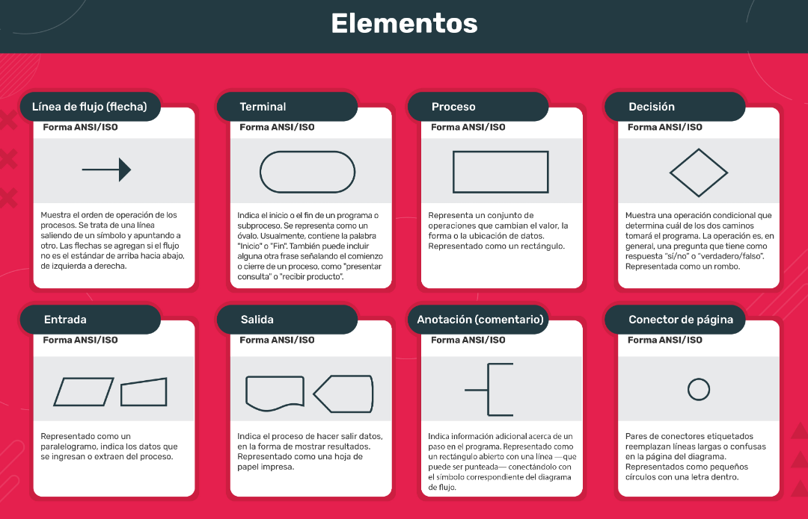

## Les damos la bienvenida a la materia Programación Imperativa!

Esperamos ser el puntapié inicial en su carrera en la programación, entendiendo el paradigma imperativo, aprendiendo los fundamentos de la disciplina y pudiendo aplicarlos en la resolución de conflictos.

No solo incorporaremos contenido teórico, sino también practicaremos e incluiremos el pensamiento computacional como herramienta para resolver problemas en nuestros contextos.

Ver lo real, convertirlo en abstracto y volverlo a transformar en software es fascinante. Los invitamos a adquirir con nosotros esta habilidad singular. Veremos cómo conducir y direccionar los datos para lograr soluciones a problemas computables.

## ¿Por qué Programación Imperativa?

La programación no es solo ver números verdes sobre un fondo negro en la oscuridad de un cuarto: programar es crear soluciones creativas a un problema, es resolver una problemática, es descubrir vías de resolución de conflictos. En esta materia vamos a entender cómo funcionan los problemas lógicos y cómo descomponerlos para poder resolverlos de manera eficiente.

Tenemos el honor de ser la puerta de entrada de muchos a la programación, a un paradigma distinto de pensar el mundo, vamos a cimentar las bases que luego servirán para que las demás materias construyan, por esto mismo esta materia es tan importante y troncal en tu cursada, ya que te va a dar las herramientas para poder desarrollarte como programador.

Esta materia será fundamental para comenzar a conocer el mundo de la programación.

## Pensamiento Computacional

Cuando vamos a cocinar algo, empezamos buscando la receta para ver qué ingredientes y utensilios vamos a necesitar. De la misma forma, en una analogía rápida, el pensamiento computacional aparece como el paso previo a programar y consiste en adaptar nuestra forma de razonar para poder resolver un problema lógico. Es importante entender cómo se tiene que pensar al programar para poder resolver un problema considerando que nuestro receptor no tiene “sentido común”, sino que solo recibe instrucciones precisas para ejecutarlas.

Por eso, antes de empezar a programar, tenemos que aprender a resolver problemas y entender qué debemos tener en cuenta para poder transmitirle a una computadora las instrucciones que queremos que ejecute.

### Vídeo

[¿Qué es el pensamiento computacional?](https://drive.google.com/file/d/1c1OgYS02UssMB2PH3ObuJbimxE6vaxRP/preview)

## Diagramas de flujo

El diagrama de flujo, flujograma o diagrama de actividades es la representación gráfica de un algoritmo o proceso. Se utiliza en disciplinas como programación, economía, procesos industriales y psicología cognitiva.

Se trata de una herramienta que nos permite determinar los pasos para poder llevar adelante un proceso o una tarea. Así, el diagrama de flujo resulta útil para pensar la resolución de un problema, sin importar qué lenguaje que vayamos a usar.

[Ejemplos PDF](https://drive.google.com/file/d/1LhfQ3fPisMekjBGdxgISiGtUUwaRtmr-/view?usp=drive_link)