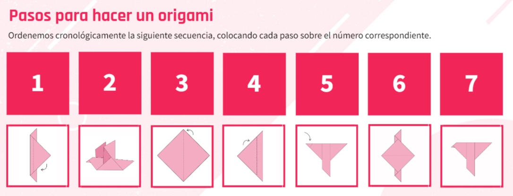

## Hacer un Origami

Como vimos en la anterior clase, el pensamiento computacional es un elemento clave en el desarrollo de nuestras capacidades de programación.

En la siguiente actividad vamos a identificar diferentes algoritmos para realizar una tarea.

Como vimos en la actividad anterior, algunos aspectos del pensamiento computacional se pueden trasladar a nuestra vida cotidiana. Ya desde pequeños nos enseñan rutinas y pasos para realizar diversas tareas. Si bien en humanos es distinto que en las computadoras —ya que estas no pueden “asumir” situaciones— la idea es similar: un algoritmo es una serie de pasos para resolver un problema.

¿Cuál es la diferencia con una computadora? Que, por ejemplo, si nos estamos lavando los dientes y no hay agua o nos quedamos sin pasta de dientes, las personas pueden buscar soluciones basadas en experiencias anteriores o improvisar una solución, en el caso de las computadoras, si un paso programado no se puede cumplir, ese proceso no avanzará y quedará inconcluso.

## Paradigmas de Programación

>Presentación

[Diapositivas](https://docs.google.com/presentation/d/1NE-Y7sLKxpnKkpgE7yuy72rmt-N8m98fa44sjuz84Zo/edit?usp=sharing)
