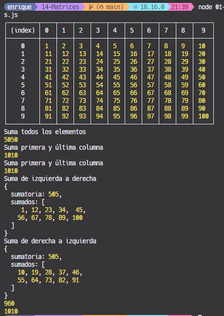
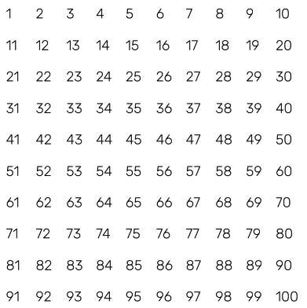
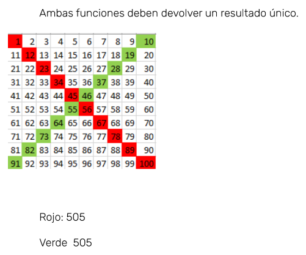

## Matrices

### Ejecución

<p align="center">
  
</p>

```javascript
const matriz = [];
//Llenamos la matriz
createSquareMAtrix(10);
console.table(matriz);
console.log('Suma todos los elementos');
console.log(sumAll(matriz));
console.log('Suma primera y última columna');
console.log(sumTwoCols(matriz, 0, 9));
console.log('Suma quinta y sexta fila');
console.log(sumTwoRows(matriz, 4, 5));
console.log('Suma de izquierda a derecha');
console.log(sumDiagonalLeft(matriz));
console.log('Suma de derecha a izquierda');
console.log(sumDiagonalRight(matriz));
```

Vamos a practicar el uso de `matrices` y, de paso, los ciclos `FOR`.

1. Seguir las instrucciones en este sandbox, para escribir y sumar los valores dentro
   de una matriz.
   [CodeSandBox ej1](https://codesandbox.io/s/mesa-17-ejercicio-1-yh91v?file=/src/index.js)

2. Crear una función que genere una matriz de 10x10. Cada fila debe tener solo 10
números. La matriz debe verse así:
<p align="center">
  
</p>

### Solución

```javascript
function createSquareMAtrix(length) {
  for (let row = 0; row < length; row++) {
    matriz[row] = new Array(length);
    for (let col = 0; col < length; col++) {
      matriz[row][col] = row * length + col + 1;
    }
  }
}
```

### 2a

```javascript
function sumAll(matrix) {
  let acc = 0;
  for (let row = 0; row < matrix.length; row++) {
    for (let col = 0; col < matrix[row].length; col++) {
      acc += matrix[row][col];
    }
  }
  return acc;
}
```

[CodeSandBox ej2](https://codesandbox.io/s/mesa-17-ejercicio-2-8glzg?file=/src/index.js)

a) crear una función que nos retorne la sumatoria de la primer y última columna (sumar la primera Y y la última)

b) crear una función que nos retorne la sumatoria de la quinta y sexta fila (la suma de ambas)

c) Una va a sumar los valores en la diagonal marcada en rojo.

d) La otra va a marcar los valores de la diagonal marcada en verde.

<p align="center">
  
</p>

### A Solución

```javascript
function sumTwoCols(matrix, col1, col2) {
  let acc = 0;
  for (let row = 0; row < matrix.length; row++) {
    acc += matrix[row][col1] + matrix[row][col2];
  }
  return acc;
}
```

### B Solución

```javascript
function sumTwoRows(matrix, row1, row2) {
  let acc = 0;
  for (let col = 0; col < matrix[row1].length; col++) {
    acc += matrix[row1][col] + matrix[row2][col];
  }
  return acc;
}
```

### C Solución

> Diagonal Izquierda

```javascript
function sumDiagonalLeft(matrix) {
  let acc = 0;
  const sumados = [];
  for (let i = 0; i < matrix.length; i++) {
    sumados.push(matrix[i][i]);
    acc += matrix[i][i];
  }
  return { sumatoria: acc, sumados };
}
```

> D Diagonal Derecha

```javascript
function sumDiagonalRight(matrix) {
  let acc = 0;
  const sumados = [];
  for (let i = 0; i < matrix.length; i++) {
    sumados.push(matrix[i][matrix.length - i - 1]);
    acc += matrix[i][matrix.length - i - 1];
  }
  return { sumatoria: acc, sumados };
}
```
